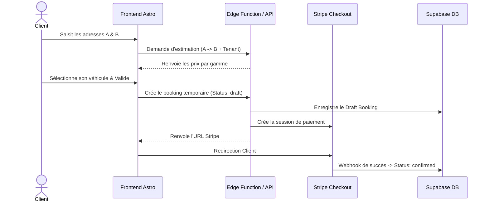

# 💼 FLOWS MÉTIER — Parcours & Tunnels Réservation

Description conceptuelle des workflows de réservation et de facturation.

## 🔄 1. Cycle de Vie d'un Booking

## 📐 2. Les Tunnels de Réservation

### A. Tunnel Transfert (Standard A -> B)
- **Composant** : `BookingTransfertTunnel.astro`
- **Champs requis** : Adresse départ, Adresse destination, Date, Heure, Gamme véhicule, Infos client (nom, email, tel, vol/train).
- **Calcul distance** : Données de géocodage/routing passées à l'Edge Function.

### B. Tunnel Mise à Disposition (MAV - À faire)
- **Champs requis** : Adresse de départ, Durée (nombre d'heures), Date, Heure, Gamme véhicule.
- **Règle de calcul** : Forfait horaire basé sur le tenant et le véhicule choisi.

### C. Tunnel Longue Distance (À faire)
- Dédié aux trajets hors secteur habituel du chauffeur. Soumis à une tarification spécifique ou devis manuel obligatoire si hors zone.

### D. Formulaire Business / Event (À faire)
- Demande de devis libre. Crée un ticket dans la boîte mail du chauffeur (pas de tunnel de paiement direct).
